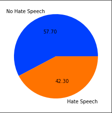
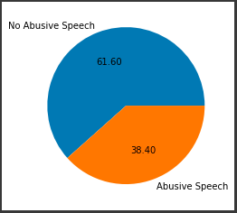
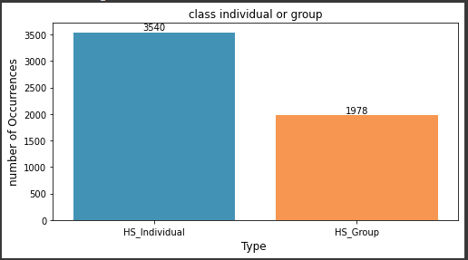
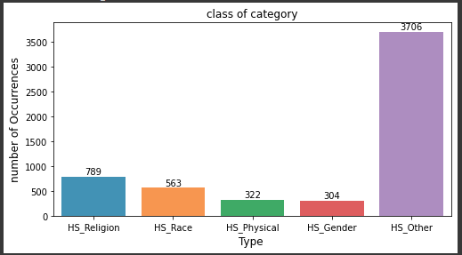
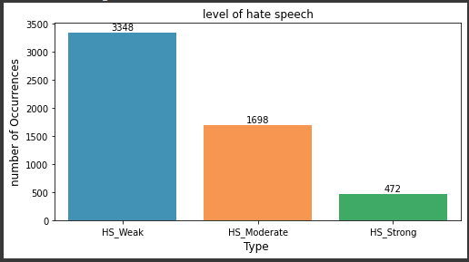
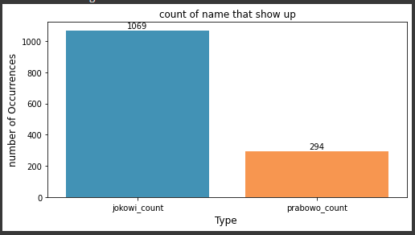
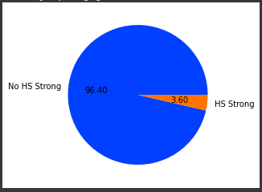
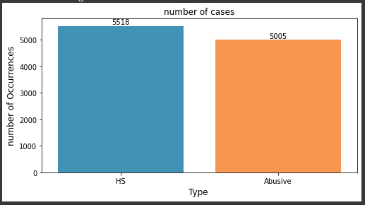

##  Projek Membuat API Cleansing Data, Analisis Dataset Multi-label Hate Speech and Abusive Language Detection in Indonesian Twitter

# Tentang API
 - API yang dibuat memiliki tujuan untuk menghilangkan beberapa hal seperti:
    - Emoji
    - Back Slash n (\n\n)
    - Punctuation (Tanda baca)
    - Url
    - Double Space
    - Hashtag

# Alamat url
 - API yang sudah dibuat memiliki alamat url http://127.0.0.1:1255

# Tentang Data
 - Data diambil dari penelitian Ibrohim and Budi (2018) pada Kaggle. link data: https://www.kaggle.com/datasets/c7af46bd64825107fff61076eeec0df32f905f0e9b7f43b7c361b53b5f404312?resource=download&select=data.csv 
    - Informasi label dari dataset dapat dilihat pada dibawah ini:
    - HS : label hate speech;
    - Abusive : label abusive language ;
    - HS_Individual : hate speech yang ditargetkan kepada suatu individu;
    - HS_Group : hate speech yang ditargetkan kepada suatu group;
    - HS_Religion : hate speech yang ditargetkan kepada suatu agama;
    - HS_Race : hate speech yang ditargetkan kepada suatu suku/ras;
    - HS_Physical : hate speech yang ditargetkan kepada suatu bentuk tubuh/disabilitas;
    - HS_Gender : hate speech yang ditargetkan kepada suatu jenis kelamin/orientasi seksual;
    - HS_Gender : hate related to other invective/slander;
    - HS_Weak : hate speech dengan level lemah;
    - HS_Moderate : hate speech dengan level sedang;
    - HS_Strong : hate speech dengan level kuat
 - Simbol 1 berarti ya (tweet dataset mengandung hate speech/abusive), 0 berarti tidak (tweet dataset tidak mengandung hate speech/abusive).

# Hasil 

- Dari visualisasi di atas, dapat diketahui bahwa sebesar 42.3% dari keseluruhan dataset merupakan Hate Speech.

- Dari visualisasi di atas, dapat diketahui bahwa sebesar 38.4% dari keseluruhan dataset merupakan Abusive Languange.

- Berdasarkan visualisasi di atas, dapat diketahui bahwa tipe Hate Speech yang ditargetkan kepada individu lebih besar totalnya daripada Hate Speech target group yakni sebesar 3540 dari keseluruhan dataset.

- Pada visualisasi Hate Speech dengan tipe kategori, diketahui bahwa kategori yang memiliki total terbanyak adalah Tipe Other. Dimana hal ini berarti bahwa Hate Speech tersebut ditujukan kepada suatu objek selain 4 kategori lain.

- Sedangkan pada kasus Hate Speech Level, Hate Speech terjadi paling banyak dalam level lemah dengan total sebesar 3348 dari keseluruhan dataset.

- Visualisasi di atas menunjukkan bahwa dari seluruh dataset, nama "jokowi" lebih banyak muncul dengan total 1069 dibanding dengan nama "prabowo".

- Berdasarkan visualisasi di atas, diketahui bahwa persentase tweet yang mengandung Hate Speech sebesar 3.6%, dimana Hate Speech dengan level strong ini memiliki kemungkinan yang besar untuk menimbulkan kekacauan.

- Visualisasi di atas menjelaskan bahwa kasus Hate Speech memiliki total lebih tinggi daripada kelas Abusive yang dengan total sebanyak 5518 dari 13044 data.

## Kesimpulan
- Berdasarkan hasil visualisasi, kesimpulan yang diambil antara lain:
    - Nama "jokowi" memiliki persentase sebesar 8.2% dimana nilai ini 4 kali lebih besar daripada nama "prabowo".
    - Persentase Tweet yang tergolong Hate Speech sebesar 42.3% dari keseluruhan Tweet, sehingga tidak mengherankan jika  sering ditemukan tweet yang mengandung nuansa negatif.
    - Dari keseluruhan dataset, tweet yang memiliki potensi untuk menimbulkan kekacauan hanya sebesar 3.6%, yakni Hate Speech level Strong.

